 

Software developer from Tanzania. I build full-stack products, bots and automation, and mobile apps, 
and I'm steadily moving toward security engineering.

  

 

<h3 align="center">Tech Stack</h3>

   
  

<h3 align="center">Languages</h3>

  JavaScript · TypeScript · Python · C++ · Kotlin

<h3 align="center">Featured Projects</h3>

### VORTE PRO

A modular WhatsApp automation project, built and deployed continuously.

<table>
  <tr>
    <td align="center"><b>9,000+</b> lines of JavaScript</td>
    <td align="center"><b>13,000+</b> total lines of code</td>
    <td align="center"><b>166</b> commits</td>
    <td align="center"><b>190</b> deployments</td>
  </tr>
</table>

 

<table>
  <tr>
    <td width="50%" valign="top">
      <h4>NEXORA</h4>
      Full-stack developer platform: QR tools, file hosting, URL shortening and developer APIs.  
      React · Vite · Tailwind CSS · Node.js
    </td>
    <td width="50%" valign="top">
      <h4>NEXQR</h4>
      Privacy-first QR and barcode scanner that decodes entirely on your device.  
      React · Vite · TypeScript · Tailwind CSS
    </td>
  </tr>
</table>

<h3 align="center">GitHub Activity</h3>

  
  

  

  

<h3 align="center">Current Focus</h3>

  

 

  

